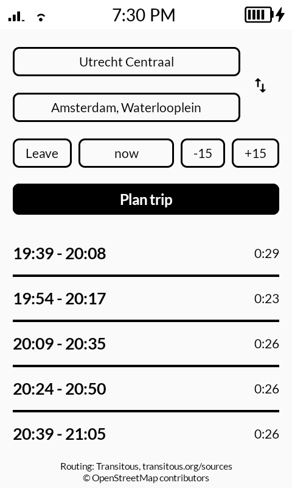
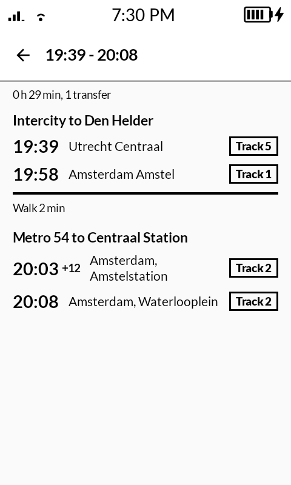
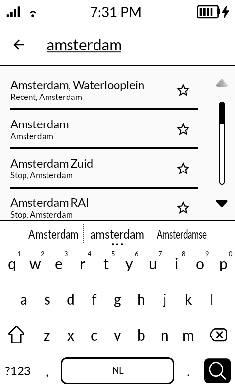

# MonoTransit

Door-to-door public transit planner for the Mudita Kompakt (e-ink), built with the Mudita Mindful Design (MMD) framework. Search stops or addresses, plan by departure or arrival time, and open a trip for a calm leg-by-leg overview with platform info. No API key or account required.

Routing and geocoding are provided by [Transitous](https://transitous.org), a free, community-run service powered by [MOTIS](https://github.com/motis-project/motis).

<p align="center">
  
  
  
</p>

## Install

```
./gradlew installDebug
```

## Structure

- `api/TransitousApi.kt`: Transitous (MOTIS) client: geocoding of stops/addresses and door-to-door planning
- `TransitViewModel.kt`: app state, planning calls, persisted favorites and recent places
- `ui/PlannerScreen.kt`: from/to/departure-time form and the compact results list
- `ui/TripDetailScreen.kt`: leg-by-leg trip overview with track chips
- `ui/SearchPicker.kt`: shared search list with favorites (star) and recents (long-press to remove)

## Transitous usage policy

This app follows the [Transitous API guidelines](https://transitous.org/api/):

- Open source under the [MIT license](LICENSE), non-commercial, and resource-light (a single request per user action, no polling or scraping).
- Every request carries a `User-Agent` identifying the app, its version, this repository and a contact address (berendcsliedrecht@gmail.com).
- Only the public endpoint `https://api.transitous.org/api/` is used.

## Data attribution

- Routing and geocoding: [Transitous](https://transitous.org), aggregating the transit feeds listed at [transitous.org/sources](https://transitous.org/sources/) (also linked in the app footer). All data remains subject to the licenses of those sources.
- Map and address data: © [OpenStreetMap](https://www.openstreetmap.org/copyright) contributors, licensed under the [ODbL](https://opendatacommons.org/licenses/odbl/).

## Support

If you find this app useful, consider [sponsoring me](https://github.com/sponsors/berendsliedrecht).

## License

[MIT](LICENSE)
